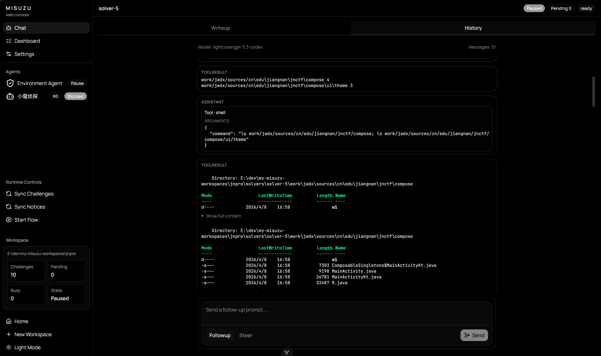
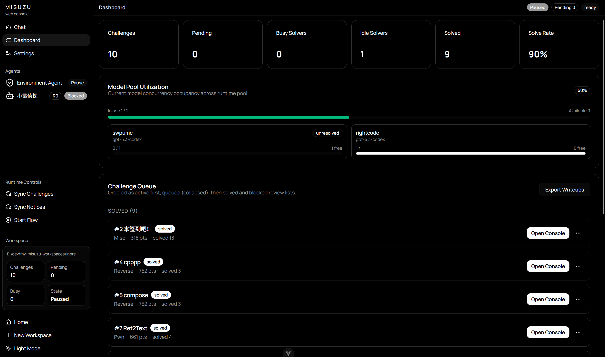
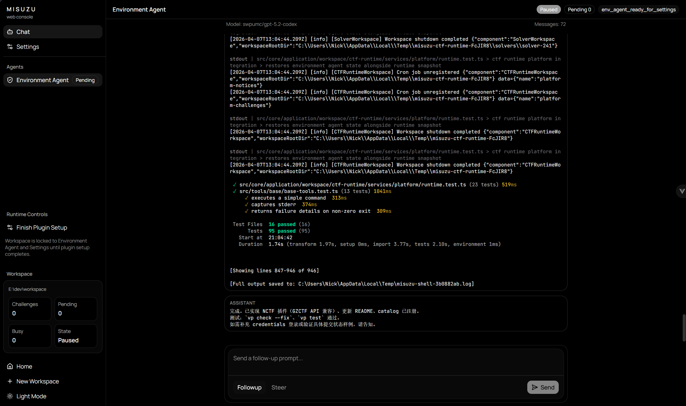
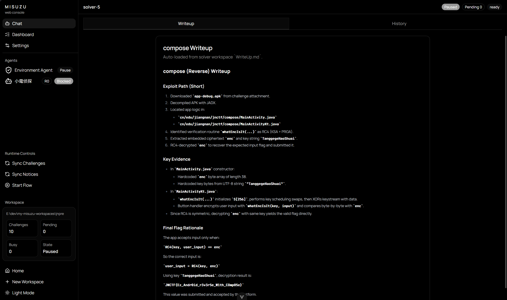

# Misuzu

Misuzu 是一个实现了平台适配、自动化编排的专为 CTF 比赛特化的多 Agent 并发系统。

## 截图

<table>
  <tr>
    <td align="center">
      <br />
      chat
    </td>
    <td align="center">
      <br />
      dashboard
    </td>
  </tr>
  <tr>
    <td align="center">
      <br />
      environment agent
    </td>
    <td align="center">
      <br />
      writeups
    </td>
  </tr>
</table>

---


## 使用

确保你的环境拥有 docker, [viteplus](https://viteplus.dev/), chrome.

```bash
# 安装 playwright-cli
npm install -g @playwright/cli@latest
# 构建 docker 沙盒环境
cd packages/misuzu-core/src/tools/misuzu/sandbox
docker build -f Dockerfile.sandbox -t ctf-sandbox .
# 安装依赖
vp i
# 启动开发服务器
vp run misuzu-web#dev:full
```

然后你就可以打开 <http://localhost:5173/> 按 UI 指示配置模型、目录等，开始梭哈一场 CTF 了。

## 注意

- 本项目还处于开发迭代阶段，暂时不接受除 bug 修复以外的 PR, 新功能提议可以先发 issue.
- 本项目目前有大量 AI 生成且未经审计的代码，使用本项目意味着你明白项目存在的潜在的风险。
